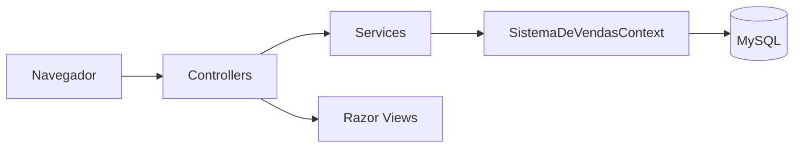

# SistemaDeVendas

Aplicação web ASP.NET Core MVC para cadastro de departamentos e vendedores, e consulta de registros de vendas com filtros por data (busca simples e busca agrupada por departamento).

## Sobre o projeto

O projeto simula um sistema interno de controle de vendas de uma empresa organizada em departamentos, cada um com vendedores associados, e vendedores com registros de vendas (data, valor e status).

Ele resolve o problema de consultar o total de vendas de um período, tanto de forma simples (lista de vendas) quanto agrupada por departamento (com totalização por grupo). Também oferece cadastro (CRUD) de departamentos e vendedores.

Trata-se de um projeto de estudo/portfólio, construído de forma incremental (o histórico de commits mostra a evolução: scaffolding de CRUD, migrations, seeding, tratamento de exceções de integridade referencial, formatação de cultura/locale, operações assíncronas e, por fim, as telas de busca simples e busca agrupada).

**Estágio atual**: funcional para os fluxos implementados (CRUD de Departamentos e Vendedores, consulta de vendas por data). Não há testes automatizados, autenticação/autorização, nem pipeline de CI/CD.

## Principais funcionalidades

Concluídas:

- CRUD completo de **Departamentos** (`DepartmentsController`): criar, listar, detalhar, editar e excluir.
- CRUD de **Vendedores** (`SellersController`): criar, listar, detalhar (com departamento carregado via eager loading), editar e excluir, com validação de dados (nome, e-mail, salário base, data de nascimento).
- Tratamento de exclusão de vendedor com vínculo de vendas: ao tentar excluir um vendedor que possui registros de venda, a aplicação captura a violação de integridade referencial (`IntegrityException`) e exibe uma página de erro amigável, em vez de uma exceção não tratada.
- Consulta de **Registros de Venda** (`SalesRecordController`), sem CRUD próprio (não há criar/editar/excluir vendas pela interface):
  - **Busca simples** (`SimpleSearch`): lista vendas em um intervalo de datas, com total somado.
  - **Busca agrupada** (`GroupingSearch`): agrupa as vendas do período por departamento, mostrando o total de cada grupo.
- Seed automático de dados de exemplo (departamentos, vendedores e vendas) ao rodar em ambiente de desenvolvimento.
- Página de erro customizada com mensagem e identificador de requisição (`ErrorViewModel`).
- Localização fixa em cultura `en-US` para formatação de datas e números.

Parcial / observações:

- `DepartmentsController` acessa o `DbContext` diretamente (sem camada de serviço) e sua ação de exclusão **não trata** violação de integridade referencial (diferente de `SellersController`) — excluir um departamento com vendedores associados pode lançar uma exceção não tratada.

<!-- TODO: adicionar screenshot ou GIF de demonstração das telas de busca simples e busca agrupada -->

## Tecnologias utilizadas

- **Backend**: ASP.NET Core MVC 2.2 (`netcoreapp2.2`), C#
- **ORM**: Entity Framework Core 2.2, com [Pomelo.EntityFrameworkCore.MySql](https://github.com/PomeloFoundation/Pomelo.EntityFrameworkCore.MySql) 2.2.0 como provider
- **Banco de dados**: MySQL
- **Frontend**: Razor Views (`.cshtml`), Bootstrap (incluindo o tema `bootstrap-darkly` em ambiente de desenvolvimento), jQuery, jQuery Validation / jQuery Validation Unobtrusive
- **Ferramentas de desenvolvimento**: Visual Studio (solução `.sln`), EF Core Migrations

Não há testes automatizados, containerização (Docker) ou pipeline de CI/CD configurados no repositório.

## Arquitetura

Aplicação monolítica em camadas simples, no padrão convencional do ASP.NET Core MVC:

- **Controllers**: recebem requisições HTTP e coordenam o fluxo (`DepartmentsController`, `SellersController`, `SalesRecordController`, `HomeController`).
- **Services**: encapsulam o acesso a dados para Vendedores, Departamentos e Registros de Venda (`SellerService`, `DepartmentService`, `SalesRecordService`), utilizando o `SistemaDeVendasContext` (EF Core). `DepartmentsController` é uma exceção e acessa o `DbContext` diretamente.
- **Models**: entidades de domínio (`Department`, `Seller`, `SalesRecord`, enum `SaleStatus`) e View Models (`SellerFormViewModel`, `ErrorViewModel`).
- **Data**: `SistemaDeVendasContext` (DbContext) e `SeedingService` (dados de exemplo).
- **Views**: Razor Views organizadas por controller.



Não há evidências suficientes no código (ex.: interfaces de repositório, separação em camadas de domínio/infraestrutura isoladas) para classificar a arquitetura como Clean Architecture, Hexagonal ou DDD — trata-se de uma organização MVC convencional.

## Estrutura do projeto

```
SistemaDeVendas/
├── Controllers/          # DepartmentsController, SellersController, SalesRecordController, HomeController
├── Data/                 # SistemaDeVendasContext (DbContext) e SeedingService
├── Migrations/            # Migrations do EF Core
├── Models/               # Department, Seller, SalesRecord, SaleStatus, ViewModels/
├── Services/             # DepartmentService, SellerService, SalesRecordService, Exceptions/
├── Views/                # Razor Views por controller + Shared/_Layout.cshtml
├── wwwroot/              # Bootstrap, jQuery, CSS/JS estáticos
├── appsettings.json      # Configuração e connection string
├── Program.cs
└── Startup.cs
```

## Pré-requisitos

- .NET Core SDK compatível com `netcoreapp2.2` (TODO: confirmar versão exata do SDK instalada, não declarada no repositório)
- MySQL em execução e acessível
- Visual Studio (solução `SistemaDeVendas.sln`) ou `dotnet` CLI

## Configuração

A connection string do banco de dados MySQL fica em `SistemaDeVendas/appsettings.json`, na chave `ConnectionStrings:SistemaDeVendasContext`, no formato:

```json
"ConnectionStrings": {
  "SistemaDeVendasContext": "server=<host>;userid=<usuario>;password=<senha>;database=sistemadevendas"
}
```

Não há arquivo `appsettings.Development.json` com connection string própria — o ambiente de desenvolvimento reutiliza a mesma connection string de `appsettings.json`, alterando apenas o nível de log.

Os arquivos `Properties/serviceDependencies.json` e `serviceDependencies.local.json` (metadados do Visual Studio Connected Services) referenciam o tipo `mssql`/`mssql.local`, o que não corresponde ao banco real (MySQL) — aparenta ser resquício de scaffolding e pode ser ignorado.

## Como executar

1. **Clonar o repositório**
   ```bash
   git clone <url-do-repositorio>
   cd TestWeb
   ```

2. **Configurar o banco de dados**

   Edite `SistemaDeVendas/appsettings.json` com uma connection string válida para o seu MySQL local (veja seção [Configuração](#configuração)).

3. **Aplicar as migrations**
   ```bash
   dotnet ef database update --project SistemaDeVendas
   ```

4. **Executar a aplicação**
   ```bash
   dotnet run --project SistemaDeVendas
   ```
   Ou, via Visual Studio, executar o projeto com o perfil `SistemaDeVendas` ou `IIS Express` (`Properties/launchSettings.json`).

5. **Acessar a aplicação**

   - Perfil `SistemaDeVendas`: `https://localhost:5001` ou `http://localhost:5000`
   - Perfil `IIS Express`: `http://localhost:63905` (HTTPS: `44396`)

   Em ambiente de desenvolvimento, a base é populada automaticamente com dados de exemplo (departamentos, vendedores e vendas) na primeira execução, caso as tabelas estejam vazias (`SeedingService.Seed()`).

## Banco de dados

- **Tecnologia**: MySQL, acessado via Entity Framework Core (provider Pomelo).
- **Schema gerenciado por migrations** (`SistemaDeVendas/Migrations/`), aplicadas em ordem: `initial` → `OtherEntities` → `DepartmentForeignKey` → `NewDatabase`.
- **Entidades**: `Department` (1‑N `Seller`), `Seller` (1‑N `SalesRecord`), `SalesRecord` (N‑1 `Seller`).
- **Seed**: `SeedingService` insere 4 departamentos, 6 vendedores e 10 registros de venda, apenas se as tabelas estiverem vazias e apenas em ambiente de desenvolvimento.

Detalhes de relacionamento, chaves estrangeiras e histórico de migrations em [docs/DATABASE.md](docs/DATABASE.md).

## Testes

Não foram encontrados projetos ou arquivos de teste automatizado (unitário, integração ou end-to-end) no repositório.

## Decisões técnicas

- Uso de camada de **Services** para encapsular acesso a dados de Vendedores, Departamentos e Vendas, separando essa lógica dos Controllers (exceto em `DepartmentsController`, que acessa o `DbContext` diretamente).
- Exceções de domínio próprias (`NotFoundException`, `DbConcurrencyException`, `IntegrityException`) para traduzir falhas de EF Core (ex.: `DbUpdateException` por violação de FK) em mensagens de erro tratáveis pela camada de apresentação.
- Cultura fixada em `en-US` via `RequestLocalizationOptions`, garantindo formatação consistente de datas e valores monetários independentemente da configuração do servidor.
- Seed de dados restrito ao ambiente de desenvolvimento (`env.IsDevelopment()`), evitando popular dados fictícios em produção.

## Limitações e próximos passos

Limitações observadas:

- Não há autenticação nem autorização — todas as rotas são públicas.
- `DepartmentsController.DeleteConfirmed` não trata violação de integridade referencial (ao contrário do fluxo equivalente em `SellersController`), podendo propagar uma exceção não tratada ao excluir um departamento com vendedores vinculados.
- Credencial de banco de dados exposta em texto plano em `appsettings.json` versionado (ver seção [Configuração](#configuração) e [docs/SECURITY.md](docs/SECURITY.md)).
- Não há testes automatizados nem pipeline de CI/CD.
- `SalesRecordController` não possui operações de criação, edição ou exclusão de vendas pela interface — apenas consulta.

Possíveis evoluções futuras (não implementadas):

- Aplicar tratamento de integridade referencial também em `DepartmentsController`.
- Adicionar autenticação/autorização.
- Adicionar testes automatizados.
- Externalizar segredos de configuração (variáveis de ambiente, User Secrets ou cofre de segredos).
- Adicionar CRUD completo de registros de venda.

## Autor

Fábio Simones

## Licença

Não há arquivo de licença no repositório.
