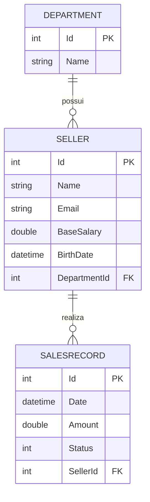

# Banco de dados

Este documento detalha o schema, os relacionamentos e o histórico de migrations do `SistemaDeVendas`, com base no que está registrado em `SistemaDeVendas/Migrations/` e no `SistemaDeVendasContextModelSnapshot.cs`.

## Tecnologia

- **SGBD**: MySQL
- **ORM**: Entity Framework Core 2.2, provider [Pomelo.EntityFrameworkCore.MySql](https://github.com/PomeloFoundation/Pomelo.EntityFrameworkCore.MySql) 2.2.0
- **DbContext**: `SistemaDeVendas.Data.SistemaDeVendasContext`, com os `DbSet<T>` `Department`, `Seller` e `SalesRecord` (nomes no singular, sem pluralização)
- Não há Fluent API em `OnModelCreating` — o `SistemaDeVendasContext.cs` não sobrescreve esse método; a configuração do modelo vem de convenções do EF Core, de Data Annotations nas entidades e de ajustes manuais aplicados diretamente nas migrations.

## Entidades e relacionamentos



- `Department` 1‑N `Seller`, via `Seller.DepartmentId`, com `OnDelete(DeleteBehavior.Cascade)` (excluir um departamento exclui seus vendedores em cascata, no nível do banco).
- `Seller` 1‑N `SalesRecord`, via a FK sombra `SellerId` (a classe `SalesRecord` não expõe uma propriedade escalar `SellerId`; ela existe como shadow property mapeada pelo EF Core a partir da navegação `Seller`).
- `SaleStatus` (enum, mapeado como `int`): `Pending = 0`, `Billed = 1`, `Cancelled = 2`.

## Migrations (em ordem)

1. **`20230815225705_initial`** — cria a tabela `Department` (`Id` identidade, `Name`).
2. **`20230819130106_OtherEntities`** — cria `Seller` (com `DepartmentId` inicialmente **nulável**, FK com `OnDelete: Restrict`) e `SalesRecord` (com `SellerId` inicialmente nulável, FK com `OnDelete: Restrict`); cria índices em `SalesRecord.SellerId` e `Seller.DepartmentId`.
3. **`20230821215444_DepartmentForeignKey`** — torna `Seller.DepartmentId` **não nulável** e altera o comportamento de exclusão da FK de `Restrict` para **`Cascade`**.
4. **`20230828214445_NewDatabase`** — torna `Seller.Name` (máx. 60 caracteres) e `Seller.Email` **não nuláveis**, alinhando o schema às Data Annotations `[Required]`/`[StringLength]` do modelo `Seller`.

> Observação: o snapshot do modelo (`SistemaDeVendasContextModelSnapshot.cs`) ainda registra `SalesRecord.SellerId` como `int?` (nulável) — não há evidência de uma migration que tenha tornado essa FK não nulável, ao contrário do que ocorreu com `Seller.DepartmentId`.

## Seed de dados

`SeedingService.Seed()` (chamado apenas em `Startup.Configure`, somente quando `env.IsDevelopment()`):

- É idempotente: verifica se `Department`, `Seller` ou `SalesRecord` já possuem registros e, em caso positivo, não insere nada.
- Insere 4 departamentos (Computer, Electronics, Fashion, Books), 6 vendedores distribuídos entre eles, e 10 registros de venda (todos com status `Billed`, datados entre 25/09/2018 e 21/10/2018).

## Aplicando as migrations

```bash
dotnet ef database update --project SistemaDeVendas
```

Requer a ferramenta `dotnet-ef` instalada e uma connection string válida configurada (veja o [README](../README.md#configuração)).
